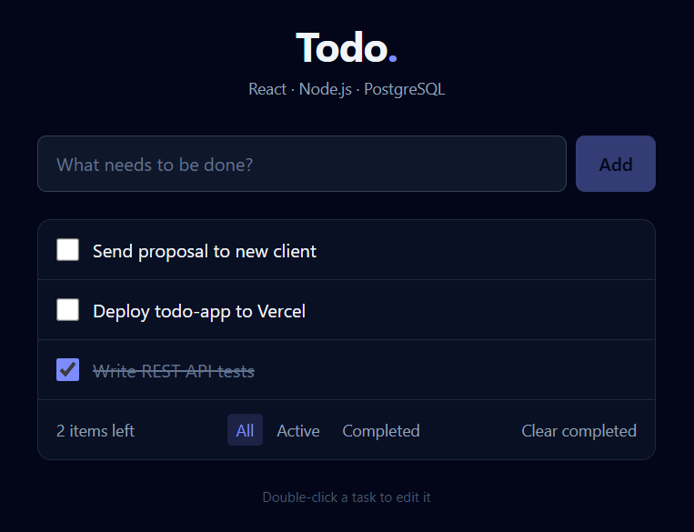

# Todo App — React + Node.js + PostgreSQL

[](https://github.com/fa-cod3/todo-app/actions/workflows/ci.yml)

A full-stack task manager: a React frontend talking to an Express REST API backed by PostgreSQL.

**🔗 Live demo: [fa-code-todo.vercel.app](https://fa-code-todo.vercel.app)** (runs in demo mode, so tasks are saved in your browser)



## Features

- ✅ Create, edit (double-click or **Edit**), complete and delete tasks
- 🔎 Filter by **All / Active / Completed**, and clear all completed tasks at once
- 💾 Tasks persisted in **PostgreSQL** through a REST API
- 🧪 Demo mode that saves to `localStorage`, so the frontend can be deployed without a backend
- 🛡️ Server-side validation (zod), helmet security headers, CORS and consistent JSON errors
- ♿ Accessible controls (labelled inputs, `aria-pressed` filters) and a responsive layout
- 🧪 **25 tests** (Jest + Supertest on the API, Vitest + Testing Library on the UI), run in GitHub Actions

## Tech stack

| Layer | Tools |
|---|---|
| Frontend | React 19, Vite, Tailwind CSS 4 |
| Backend | Node.js, Express 5, zod |
| Database | PostgreSQL (`pg`) |
| Testing | Jest, Supertest, pg-mem, Vitest, Testing Library |

## Getting started

Requirements: Node.js 20+ and Docker (or any PostgreSQL instance).

```bash
git clone https://github.com/fa-cod3/todo-app.git
cd todo-app

# 1. Database
docker compose up -d

# 2. API (http://localhost:3000)
cd server
npm install
cp .env.example .env
npm run dev

# 3. Frontend (http://localhost:5173), in a second terminal
cd client
npm install
npm run dev
```

The Vite dev server proxies `/api` requests to the API on port 3000.

To try the frontend alone, without a database:

```bash
cd client
VITE_DEMO_MODE=true npm run dev
```

### Tests

```bash
cd server && npm test   # API tests against an in-memory PostgreSQL
cd client && npm test   # UI and API-client tests
```

## REST API

| Method | Endpoint | Body | Description |
|---|---|---|---|
| `GET` | `/api/todos?status=all\|active\|completed` | — | List todos (default `all`) |
| `POST` | `/api/todos` | `{ "title": "..." }` | Create a todo |
| `PATCH` | `/api/todos/:id` | `{ "title"?, "completed"? }` | Update a todo |
| `DELETE` | `/api/todos/:id` | — | Delete a todo |
| `DELETE` | `/api/todos/completed` | — | Delete all completed todos |
| `GET` | `/api/health` | — | Health check |

Errors are returned as JSON, for example:

```json
{ "error": "Validation failed", "details": [{ "field": "title", "message": "Title is required" }] }
```

## Deployment

- **Frontend (Vercel):** import the repo, set **Root Directory** to `client`, and add the env var `VITE_DEMO_MODE=true` for a standalone demo, or `VITE_API_URL=https://your-api.example.com` to use a deployed API.
- **API:** any Node host (Render, Railway, Fly.io…) with a `DATABASE_URL` pointing to PostgreSQL (e.g. Neon or Supabase). Set `CORS_ORIGIN` to the frontend URL.

## Project structure

```
client/                 # React + Vite frontend
├── src/api.js          # HTTP store (REST API) and local store (demo mode)
├── src/useTodos.js     # State hook
└── src/components/     # TodoForm, TodoItem
server/                 # Express API
├── src/app.js          # App factory (injectable DB, used by tests)
├── src/routes/         # /api/todos endpoints
├── src/repositories/   # Parameterized SQL
└── src/db/             # Pool, schema.sql, migration
```

## License

MIT
